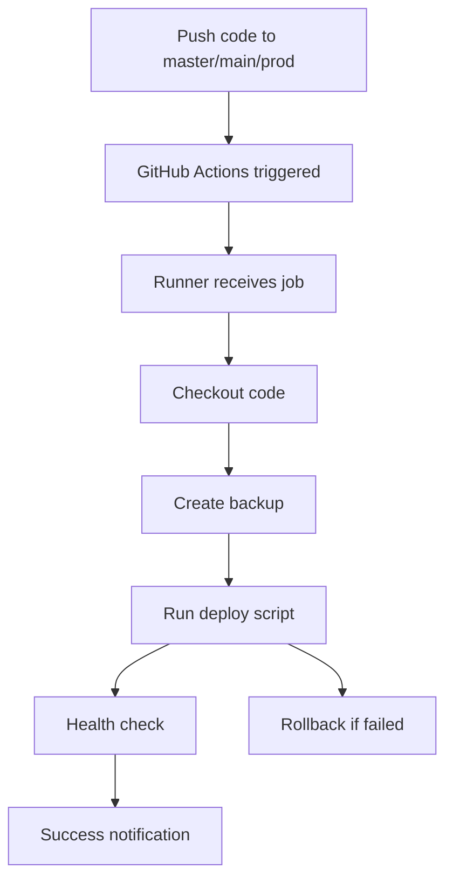

# Hapas E-commerce CI/CD System

## ✅ Hệ thống CI/CD đã được triển khai thành công!

### Cấu hình hoàn thành:

1. **GitHub Actions Runner**: ✅ Đã cài đặt và chạy
   - Runner name: `hapas-runner`
   - Status: Listening for jobs
   - Location: `/var/www/hapas_ecommerce/actions-runner`

2. **Workflow Automation**: ✅ 
   - File: `.github/workflows/production-deploy.yml`
   - Trigger: Push to `master`, `main`, hoặc `prod` branch
   - Chức năng: Auto build + deploy + health check

3. **Deployment Scripts**: ✅
   - Main script: `scripts/deploy.sh`
   - Health check: `scripts/health-check.sh`
   - Monitor: `scripts/monitor-runner.sh`

4. **Docker Configuration**: ✅
   - Production compose: `docker-compose.prod.yml`
   - Environment: `.env.production`

### Quy trình hoạt động:

### Cách sử dụng:

1. **Tự động**: Chỉ cần push code vào nhánh `master`, `main`, hoặc `prod`
2. **Thủ công**: Chạy workflow từ GitHub Actions tab
3. **Rollback**: Tự động rollback nếu deployment failed

### Monitoring:

- Logs: `/home/hapas/logs/deployment-history.log`
- Runner logs: `/var/www/hapas_ecommerce/actions-runner/runner.log`
- Application: http://localhost:3001

### Status: 🟢 READY
Hệ thống sẵn sàng tự động deploy khi có thay đổi code!

---
Tạo lúc: 
Tue Sep 30 11:48:54 +07 2025
